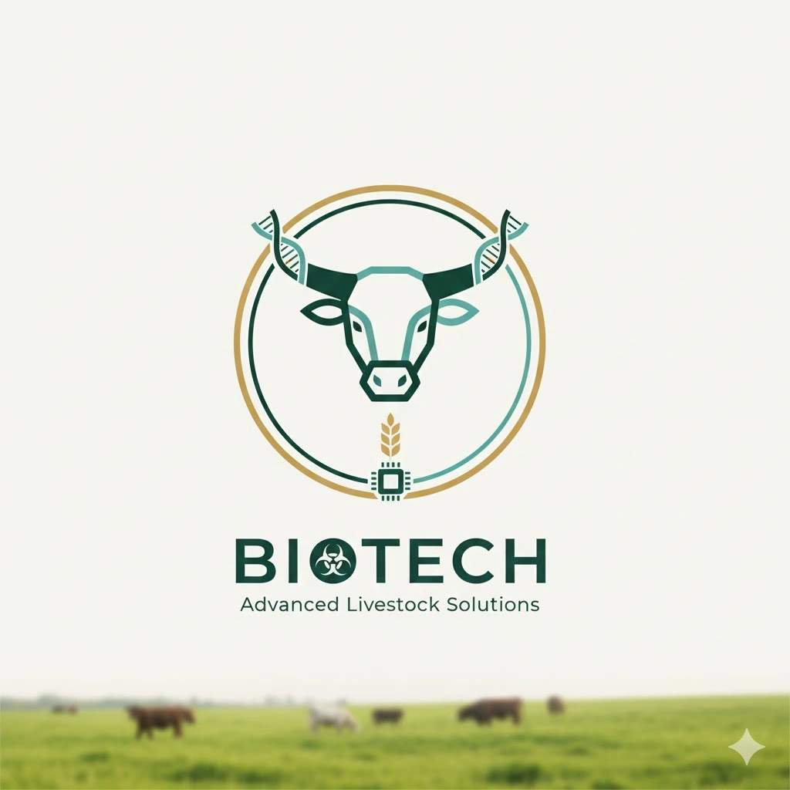

# 🧬 BioTech Shell Application

<div align="center">

  
  
  

  <br />

[](https://reactjs.org/)
[](https://vitejs.dev/)
[](https://tailwindcss.com/)
[](https://webpack.js.org/concepts/module-federation/)

  <br />

  <a href="https://biotech-shell.vercel.app/">
    
  </a>
  <a href="https://github.com/Nikotastic/BioTech-Backend">
    
  </a>

</div>

<br />

## 📋 Overview

The **BioTech Shell** is the central command center for the BioTech Farm Management platform. Orchestrating a constellation of microfrontends, it delivers a seamless, unified experience for managing every aspect of agricultural operations—from livestock tracking to financial reporting.

---

## 🧩 Microfrontend Ecosystem

The Shell integrates these specialized modules into one cohesive application:

| Module              | Deployment                                      | Primary Function     |
| :------------------ | :---------------------------------------------- | :------------------- |
| **🔐 Auth**         | [Merged App](https://biotech-shell.vercel.app/) | Identity & Security  |
| **🐮 Animals**      | [Merged App](https://biotech-shell.vercel.app/) | Livestock Registry   |
| **🌾 Feeding**      | [Merged App](https://biotech-shell.vercel.app/) | Nutrition Management |
| **🩺 Health**       | [Merged App](https://biotech-shell.vercel.app/) | Veterinary Records   |
| **🧬 Reproduction** | [Merged App](https://biotech-shell.vercel.app/) | Genetic Lineage      |
| **💼 Commercial**   | [Merged App](https://biotech-shell.vercel.app/) | Sales & Finance      |
| **📦 Inventory**    | [Merged App](https://biotech-shell.vercel.app/) | Resource Control     |

---

## 🛠️ Tech Stack & Design

- **Core Engine**: React 19, Vite (Host)
- **Architecture**: Microfrontends via Module Federation
- **State Layer**: Zustand (Global Store)
- **Styling**: TailwindCSS (Premium UI Kit)
- **Navigation**: React Router DOM (v6)

---

## 🚀 Getting Started

### Prerequisites

- Node.js (v18+)
- npm

### Installation

1.  **Clone the repository**

    ```bash
    git clone https://github.com/Nikotastic/biotech-shell.git
    cd biotech-shell
    ```

2.  **Install dependencies**

    ```bash
    npm install
    ```

3.  **Run the application**
    ```bash
    npm run dev
    ```
    The shell will be available at `http://localhost:5173`.

> **Note:** For the full experience, ensure all other microfrontends are running on their respective ports.

---

## 📦 Deployment Configuration

This project is deployed on **Vercel** and connects to the BioTech backend.

1.  Push to GitHub.
2.  Import project into Vercel.
3.  Configure Remote URLs in Environment Variables.

---

## 🤝 Contributing & Credits

<div align="center">

**Core Architecture & Development**<br>
Built with ❤️ by [**@Nikotastic**](https://github.com/Nikotastic)

  <br>

**UX/UI Design & Creative Direction**<br>
Special thanks to [**@J2rkan**](https://github.com/J2rkan) for the premium design contributions.

</div>

<br>

---

<div align="center">
  
</div>
